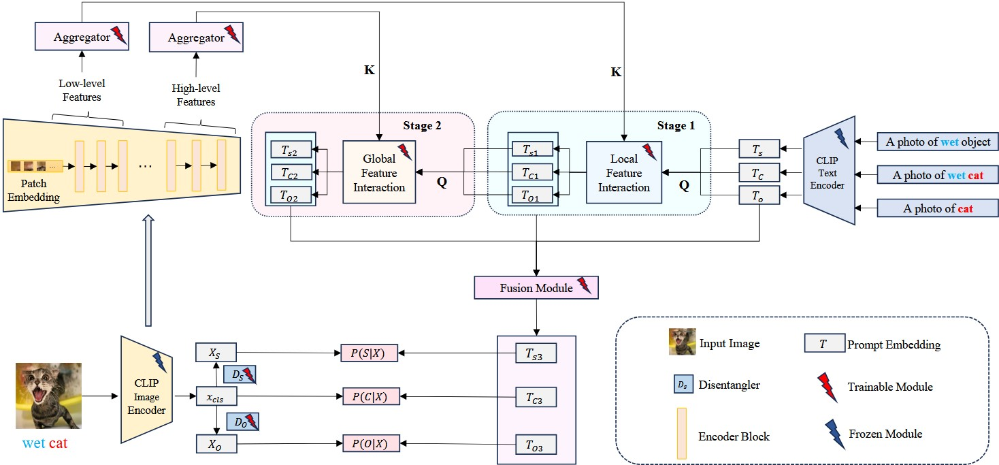

# MSCI: Addressing CLIP's Inherent Limitations for Compositional Zero-Shot Learning

## 🧠Model Structure



## ⚙️Project Setup and Requirements

To run the project, follow the steps below.

### Install Required Environment

First, install the necessary environment by running the following command:

```bash
pip install -r requirements.txt
```

### Download Backbone Model (ViT-L14)

Next, you need to download the backbone (ViT-L14) model using `wget`. Use the following command:

```bash
cd <VIT_ROOT>
wget https://openaipublic.azureedge.net/clip/models/b8cca3fd41ae0c99ba7e8951adf17d267cdb84cd88be6f7c2e0eca1737a03836/ViT-L-14.pt
```

### Dataset Download

We conduct experiments on three datasets: Mit-states, Ut-zappos, and C-GQA. Please download these datasets and place them in the `MSCI/code/download_data` directory. Use the links below to download them:

- **Mit-states**: [Mit-states dataset](https://web.mit.edu/phillipi/Public/states_and_transformations/index.html)
- **Ut-zappos**: [Ut-zappos dataset](https://vision.cs.utexas.edu/projects/finegrained/utzap50k/)
- **C-GQA**: [C-GQA dataset](https://github.com/ExplainableML/czsl)

Once downloaded, run the following command to set up the datasets:

```bash
sh download_data.sh
```

## 🏋️Model Training

### Training in Closed-World Setting

To train the model in the closed-world setting, use the following command:

```bash
python -u train_base.py \
--clip_arch <VIT_ROOT>/ViT-L-14.pt \
--dataset_path <DATASET_ROOT>/<DATASET> \
--save_path <SAVE_ROOT>/<DATASET> \
--yml_path ./config/msci/<DATASET>.yml \
--num_workers 10 \
--seed 0
```

### Evaluating in Closed-World Setting

To evaluate the model's performance in the closed-world setting, run the following command:

```bash
python -u test_base.py \
--clip_arch <VIT_ROOT>/ViT-L-14.pt \
--dataset_path <DATASET_ROOT>/<DATASET> \
--save_path <SAVE_ROOT>/<DATASET> \
--yml_path ./config/msci/<DATASET>.yml \
--num_workers 10 \
--seed 0 \
--load_model <SAVE_ROOT>/<DATASET>/val_best.pt
```

### Evaluating in Open-World Setting

To evaluate the model's performance in the open-world setting, we need to compute feasibility scores for all candidate combinations and filter based on these scores. The configuration files for the feasibility scores of each dataset are embedded in the code, allowing you to directly evaluate the model’s performance in the open-world setting with the following command:

```bash
python -u test_base.py \
--clip_arch <VIT_ROOT>/ViT-L-14.pt \
--dataset_path <DATASET_ROOT>/<DATASET> \
--save_path <SAVE_ROOT>/<DATASET> \
--yml_path ./config/msci/<DATASET>-ow.yml \
--num_workers 10 \
--seed 0 \
--load_model <SAVE_ROOT>/<DATASET>/val_best.pt
```


## 📊 Model Performance Comparison 

<h3>Performance in Closed-World Setting</h3>

<table>
  <thead>
    <tr>
      <th rowspan="2">Model</th>
      <th rowspan="2">Venue</th>
      <th colspan="4">MIT-States</th>
      <th colspan="4">UT-Zappos</th>
      <th colspan="4">C-GQA</th>
    </tr>
    <tr>
      <th>S</th><th>U</th><th>H</th><th>AUC</th>
      <th>S</th><th>U</th><th>H</th><th>AUC</th>
      <th>S</th><th>U</th><th>H</th><th>AUC</th>
    </tr>
  </thead>
  <tbody>
    <tr><td>CSP</td><td>ICLR</td><td>46.6</td><td>49.9</td><td>36.3</td><td>19.4</td><td>64.2</td><td>66.2</td><td>46.6</td><td>33.0</td><td>28.8</td><td>26.8</td><td>20.5</td><td>6.2</td></tr>
    <tr><td>DFSP</td><td>CVPR</td><td>46.9</td><td>52.0</td><td>37.3</td><td>20.6</td><td>66.7</td><td>71.7</td><td>47.2</td><td>36.9</td><td>38.2</td><td>32.9</td><td>27.1</td><td>10.5</td></tr>
    <tr><td>HPL</td><td>IJCAI</td><td>47.5</td><td>50.6</td><td>37.3</td><td>20.2</td><td>63.0</td><td>68.8</td><td>48.2</td><td>35.0</td><td>30.8</td><td>28.4</td><td>22.4</td><td>7.2</td></tr>
    <tr><td>GIPCOL</td><td>WACV</td><td>48.5</td><td>49.6</td><td>36.6</td><td>19.9</td><td>65.0</td><td>68.5</td><td>48.8</td><td>36.2</td><td>31.9</td><td>28.4</td><td>22.5</td><td>7.1</td></tr>
    <tr><td>Troika</td><td>CVPR</td><td>49.0</td><td><em>53.0</em></td><td><em>39.3</em></td><td>22.1</td><td>66.8</td><td>73.8</td><td><em>54.6</em></td><td><em>41.7</em></td><td><em>41.0</em></td><td><em>35.7</em></td><td><em>29.4</em></td><td><em>12.4</em></td></tr>
    <tr><td>CDS-CZSL</td><td>CVPR</td><td><strong>50.3</strong></td><td>52.9</td><td>39.2</td><td><em>22.4</em></td><td>63.9</td><td><em>74.8</em></td><td>52.7</td><td>39.5</td><td>38.3</td><td>34.2</td><td>28.1</td><td>11.1</td></tr>
    <tr><td>PLID</td><td>ECCV</td><td>49.7</td><td>52.4</td><td>39.0</td><td>22.1</td><td><em>67.3</em></td><td>68.8</td><td>52.4</td><td>38.7</td><td>38.8</td><td>33.0</td><td>27.9</td><td>11.0</td></tr>
    <tr><td>MSCI</td><td>IJCAI</td><td><em>50.2</em></td><td><strong>53.4</strong></td><td><strong>39.9</strong></td><td><strong>22.8</strong></td><td><strong>67.4</strong></td><td><strong>75.5</strong></td><td><strong>59.2</strong></td><td><strong>45.8</strong></td><td><strong>42.4</strong></td><td><strong>38.2</strong></td><td><strong>31.7</strong></td><td><strong>14.2</strong></td></tr>
  </tbody>
</table>


<h3>Performance in Open-World Setting</h3>

<table>
  <thead>
    <tr>
      <th rowspan="2">Model</th>
      <th rowspan="2">Venue</th>
      <th colspan="4">MIT-States</th>
      <th colspan="4">UT-Zappos</th>
      <th colspan="4">C-GQA</th>
    </tr>
    <tr>
      <th>S</th><th>U</th><th>H</th><th>AUC</th>
      <th>S</th><th>U</th><th>H</th><th>AUC</th>
      <th>S</th><th>U</th><th>H</th><th>AUC</th>
    </tr>
  </thead>
  <tbody>
    <tr><td>CSP</td><td>ICLR</td><td>46.3</td><td>15.7</td><td>17.4</td><td>5.7</td><td>64.1</td><td>44.1</td><td>38.9</td><td>22.7</td><td>28.7</td><td>5.2</td><td>6.9</td><td>1.2</td></tr>
    <tr><td>DFSP</td><td>CVPR</td><td>47.5</td><td>18.5</td><td>19.3</td><td>6.8</td><td>66.8</td><td>60.0</td><td>44.0</td><td>30.3</td><td>38.3</td><td>7.2</td><td>10.4</td><td>2.4</td></tr>
    <tr><td>HPL</td><td>IJCAI</td><td>46.4</td><td>18.9</td><td>19.8</td><td>6.9</td><td>63.4</td><td>48.1</td><td>40.2</td><td>24.6</td><td>30.1</td><td>5.8</td><td>7.5</td><td>1.4</td></tr>
    <tr><td>GIPCOL</td><td>WACV</td><td>48.5</td><td>16.0</td><td>17.9</td><td>6.3</td><td>65.0</td><td>45.0</td><td>40.1</td><td>23.5</td><td>31.6</td><td>5.5</td><td>7.3</td><td>1.3</td></tr>
    <tr><td>Troika</td><td>CVPR</td><td>48.8</td><td>18.7</td><td>20.1</td><td>7.2</td><td>66.4</td><td>61.2</td><td>47.8</td><td><em>33.0</em></td><td><em>40.8</em></td><td>7.9</td><td>10.9</td><td><em>2.7</em></td></tr>
    <tr><td>CDS-CZSL</td><td>CVPR</td><td><strong>49.4</strong></td><td><strong>21.8</strong></td><td><strong>22.1</strong></td><td><strong>8.5</strong></td><td>64.7</td><td><em>61.3</em></td><td><em>48.2</em></td><td>32.3</td><td>37.6</td><td><em>8.2</em></td><td><em>11.6</em></td><td><em>2.7</em></td></tr>
    <tr><td>PLID</td><td>ECCV</td><td>49.1</td><td>18.7</td><td>20.4</td><td>7.3</td><td><strong>67.6</strong></td><td>55.5</td><td>46.6</td><td>30.8</td><td>39.1</td><td>7.5</td><td>10.6</td><td>2.5</td></tr>
    <tr><td>MSCI</td><td>IJCAI</td><td><em>49.2</em></td><td><em>20.6</em></td><td><em>21.2</em></td><td><em>7.9</em></td><td><em>67.4</em></td><td><strong>63.0</strong></td><td><strong>53.2</strong></td><td><strong>37.3</strong></td><td><strong>42.0</strong></td><td><strong>10.6</strong></td><td><strong>13.7</strong></td><td><strong>3.8</strong></td></tr>
  </tbody>
</table>

- **S / U / H**: Seen / Unseen / Harmonic Mean
- **AUC**: Area Under Curve
- **Bold**: Best result
- *Italic*: Second-best result


## 📝 Notes

1. **Ensure Directories Are Correct**: Before running the commands, verify that the paths to the model files, datasets, and save directories are correctly specified. Replace placeholders like `<CLIP_MODEL_ROOT>`, `<DATASET_ROOT>`, and `<SAVE_ROOT>` with the actual paths.

2. **Check for Dependencies**: Make sure all required libraries and dependencies are correctly installed using the provided `requirements.txt` file. This ensures that the environment is set up for running the experiments smoothly.

3. **Evaluation Configurations**: Make sure to select the correct configuration file based on your dataset (`<DATASET>` in the commands above), whether for the closed-world or open-world setting.

4. **Troubleshooting**: In case of issues with downloading datasets or model weights, check your internet connection or the validity of the provided download links.


## Acknowledgement

Our code references the following projects:

* [DFSP](https://github.com/Forest-art/DFSP)
* [AdaptFormer](https://github.com/ShoufaChen/AdaptFormer)
* [Troika](https://github.com/bighuang624/Troika)


